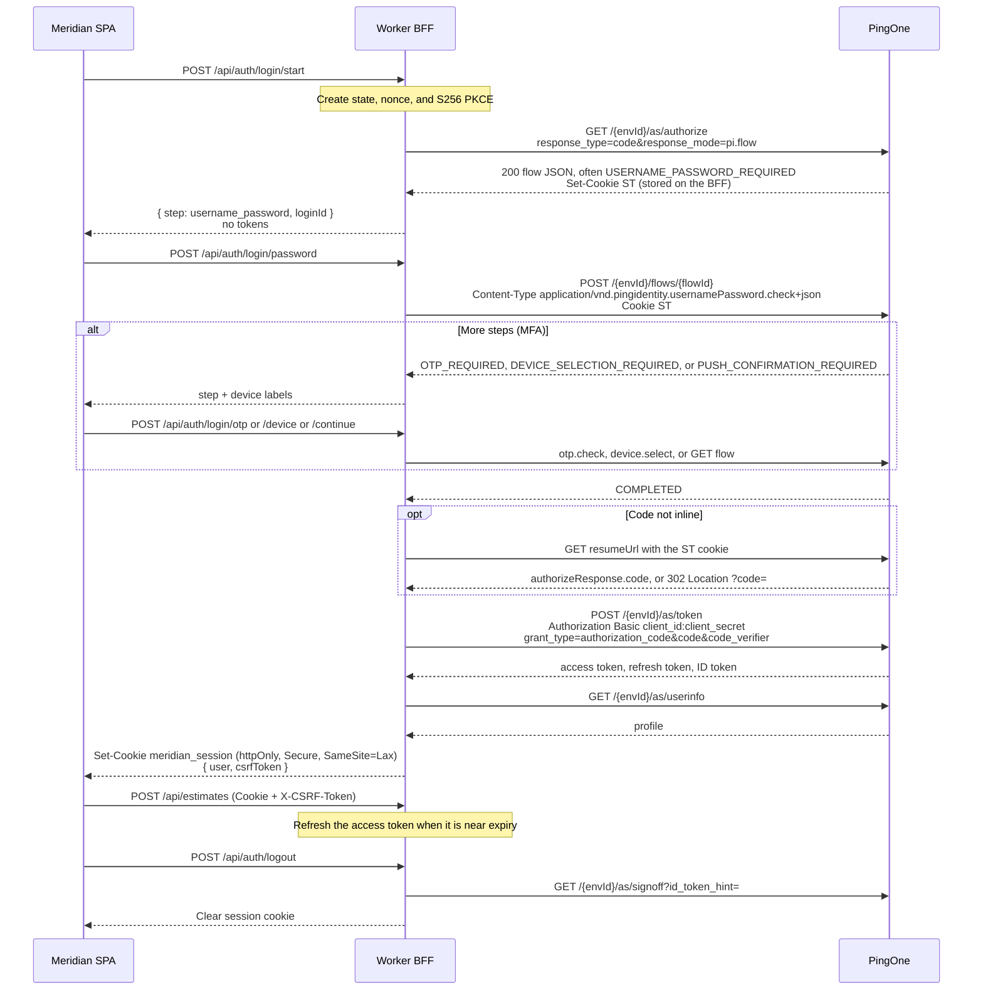

# Meridian

Meridian is a single-page estimating app for heavy civil bids, in the spirit of HCSS HeavyBid. A Cloudflare Worker is the backend-for-frontend: it owns PingOne login, keeps tokens and the client secret on the server, and stores estimate data in D1. The browser only receives an httpOnly session cookie.

Everything here runs on Cloudflare’s free plan, plus PingOne as the only external identity provider. A local mock mode runs the whole product with no tenant.

## Architecture

```text
Browser (React SPA)                Cloudflare Worker (BFF)                 PingOne
custom login UI          cookie     Hono API + static assets        pi.flow + Flows API
estimates workspace  <----------->  sessions in KV                  authorize / token / userinfo
                         JSON        estimates in D1
```

The SPA is built with Vite and served as Workers static assets. Requests under `/api/*` run the Worker first. TanStack Router and TanStack Query handle navigation and data loading. Zod schemas in `src/shared` validate writes on the Worker; the same cost functions price a bid in the browser (live preview) and again when a change is saved.

### pi.flow login

The browser never redirects to a PingOne-hosted page and never sees an access token, refresh token, ID token, or client secret.



Shapes follow PingOne’s current platform docs:

- `response_mode=pi.flow` returns the authorize response as JSON with status 200. `redirect_uri` is not required for that mode. When `PINGONE_REDIRECT_URI` is set, the BFF sends the same value on authorize and on the token request.
- Flow actions are `POST /{envId}/flows/{flowId}` with PingOne media types: `application/vnd.pingidentity.usernamePassword.check+json` (`{ username, password }`), `application/vnd.pingidentity.device.select+json` (`{ device: { id } }`), and `application/vnd.pingidentity.otp.check+json` (`{ otp }`).
- The BFF stores PingOne’s `ST` session cookie and sends it on later flow and resume calls.
- A completed authorization-code flow exposes `authorizeResponse.code`. If that field is absent, the BFF calls `resumeUrl` and accepts either a 200 JSON body or a 302 `Location` containing `code`.
- The token endpoint uses `CLIENT_SECRET_BASIC` (`Authorization: Basic`). PKCE `code_verifier` is sent because the authorize request included `code_challenge_method=S256`. The client secret is never placed in the URL or the form body.
- Logout calls `GET /{envId}/as/signoff?id_token_hint=` and always deletes the local session.

The app session lasts 12 hours. Access tokens are refreshed with `grant_type=refresh_token` when they are inside a minute of expiry. State-changing requests must send `X-CSRF-Token` matching the token issued with the session, and a browser `Origin` must match this app.

### Bid math

Hours = quantity ÷ production rate when a crew is assigned and the rate is above zero. Labor and equipment are that duration times the crew’s blended hourly rates (the whole spread, not one person). Material unit cost is multiplied by quantity and waste. Subcontract unit cost ignores waste. Lump sums are taken as entered.

Markups stack in this order: overhead on direct cost, profit on direct plus overhead, bond on that subtotal, contingency on direct cost. The bid is the sum. The browser recomputes this as you type; the Worker recomputes it when the change is saved.

## Local development

Requires Node.js 22 or newer.

```bash
npm install
cp .dev.vars.example .dev.vars
npm run dev
```

Open http://localhost:5173. `.dev.vars` turns mock mode on. Production config does not.

Mock account:

| | |
| --- | --- |
| Username | `robert@meridian.test` |
| Password | `stake-demo` |
| MFA password | `mfa-demo`, then code `482913` |
| Create account | `ada@meridian.test` / `Stake-1847`, then code `18472639` |

The first time an account opens the bid book, Meridian copies **US 183 Frontage & Drainage — Segment 4** into that account only. Estimates are stored with `owner_id` and every read or write is filtered by the signed-in user, so two testers never see each other’s bids. Change a quantity and the bid total updates before you save. Save persists it in local D1.

Create account is linked from the sign-in screen. The mock password check requires 8 characters, a letter, and a number. `robert@meridian.test` is already taken. A weak password lists those requirements on the form.

Mock mode is active only when `PINGONE_MOCK` is the string `true`. `wrangler.jsonc` sets it to `false`. Do not deploy with mock mode on.

## PingOne setup

Create these in the PingOne admin console for the environment Robert will use. The BFF is a confidential OIDC client. It is not a single-page app and it is not a worker/service app.

1. **Application type:** OIDC **Web application**.
2. **Grant types:** Authorization Code and Refresh Token.
3. **Response type:** Code.
4. **Token endpoint authentication method:** Client Secret Basic.
5. **PKCE:** leave PKCE allowed. Meridian always sends `code_challenge_method=S256` together with the client secret. PingOne’s confidential-client token docs include `code_verifier` on that grant.
6. **Redirect URI:** register one HTTPS URL and set the same value as `PINGONE_REDIRECT_URI`. `pi.flow` does not send the browser there. The token endpoint still expects `redirect_uri` when the application has one, and it must match the authorize request. Example: `https://meridian.example.com/oauth/callback`.
7. **Sign-on policy:** a Login policy (username and password). Add an MFA policy if you want device selection, OTP, or push. Meridian renders those steps. Password reset, agreements, and FIDO assertion steps are reported and are not collected in this demo.
8. **Scopes:** request `openid profile email offline_access`. If the application has an OpenID resource grant, include `offline_access` on that grant so a refresh token is issued. If it has no resource grant, PingOne still issues a refresh token for the authorization-code grant when Refresh Token is enabled.
9. **CORS:** not required. The Worker calls PingOne, not the browser.
10. Copy the **Environment ID**, **Client ID**, and **Client Secret**.

### Self-service registration

Meridian stays on its own pages. The BFF starts the same `pi.flow` authorize request used for sign-in. When the flow’s `_links` include `user.register`, the create-account form posts to the BFF, and the BFF calls PingOne:

| Step | Method and body |
| --- | --- |
| Register | `POST /{envId}/flows/{flowId}` with `Content-Type: application/vnd.pingidentity.user.register+json` and `{"username","email","password"}` |
| Verify | same URL with `application/vnd.pingidentity.user.verify+json` and `{"verificationCode"}` |
| Resend | same URL with `application/vnd.pingidentity.user.sendVerificationCode+json` and `{}` |

The verification code is 8 alphanumeric characters and has no timeout ([verify user](https://developer.pingidentity.com/pingone-api/auth/flows/registration-and-verification/verify-user.html)). A successful verify returns `COMPLETED`, and Meridian exchanges the authorization code for a normal session. Password-policy failures, `UNIQUENESS_VIOLATION`, and an invalid `verificationCode` are shown on the form with PingOne’s code, message, and details. If `user.register` is missing from the flow, the page tells you registration is off.

The resend call sends an empty JSON object. The flow docs page currently copies the verify request model and lists `verificationCode` as required, but the action text is only “send the user a new account verification email,” and the management API with this same media type has an empty body ([register](https://developer.pingidentity.com/pingone-api/auth/flows/registration-and-verification/register-user.html), [resend](https://developer.pingidentity.com/pingone-api/auth/flows/registration-and-verification/send-resend-verification-code.html)).

Turn these on in the tenant:

1. **Registration action.** Edit the sign-on policy attached to the Meridian application and add Registration. That is what puts `user.register` on the `USERNAME_PASSWORD_REQUIRED` flow. Without it, create account explains that registration is not enabled.
2. **Population.** On that Registration action, choose the population new users join.
3. **Email verification.** Enable account verification so PingOne returns `VERIFICATION_CODE_REQUIRED` and emails the 8-character code. The environment needs a working email sender and the verification notification enabled. Users type the code into Meridian; the browser is not sent to a hosted page.
4. **Password policy.** The population’s password policy is what rejects weak passwords. Meridian lists each `INVALID_VALUE` on `password`, including any requirement strings PingOne puts in `innerError`.
5. **Uniqueness.** A username or email that already exists comes back as `UNIQUENESS_VIOLATION`. Meridian says the account is already registered.

Sign-up, verification, and resend are limited per IP in KV (8, 12, and 6 attempts per 15 minutes). The address is `CF-Connecting-IP`. This uses the existing `SESSIONS` namespace, so no extra Cloudflare product is required.

Auth hosts, from PingOne’s regional API domains:

| Region | `PINGONE_AUTH_HOST` |
| --- | --- |
| North America | `https://auth.pingone.com` |
| Canada | `https://auth.pingone.ca` |
| Europe | `https://auth.pingone.eu` |
| Asia Pacific | `https://auth.pingone.asia` |
| Australia | `https://auth.pingone.com.au` |
| Singapore | `https://auth.pingone.sg` |

Confirm the host against [PingOne API domains](https://developer.pingidentity.com/pingone-api/auth/working-with-pingone-apis.html) if Ping changes a region.

### PingOne returns "Invalid username and/or password"

That sentence is PingOne's own `usernamePassword.check` detail (`INVALID_VALUE`, target `username`). A wrong password, a missing password, a user in another population, and a user in another environment all come back with the same detail. The login alert and `POST /api/auth/login/password` now include the rest of PingOne's error. `wrangler tail` (and the local dev terminal) prints the same fields as one JSON line, `pingone.auth.failed`.

```json
{
  "error": "Invalid username and/or password.",
  "pingone": {
    "status": 400,
    "id": "6c796712-0f16-4062-815a-e0a92f4a2143",
    "code": "INVALID_DATA",
    "message": "The request could not be completed. One or more validation errors were in the request.",
    "details": [
      {
        "code": "INVALID_VALUE",
        "target": "username",
        "message": "Invalid username and/or password."
      }
    ],
    "correlationId": "present when PingOne sends Correlation-Id",
    "requestId": "present when PingOne sends X-Request-Id"
  }
}
```

`pingone.id` is the id PingOne stores in its logs ([error codes](https://developer.pingidentity.com/pingone-api/platform/reference/error-codes.html)). `pingone.status` is the HTTP status PingOne returned. `correlationId` and `requestId` appear only when those response headers are present. Tokens, the client secret, and the password are not in this JSON or the log line.

On the next attempt, check the tenant against `pingone.code` and `pingone.details[].target`:

1. The user exists in the environment named by `PINGONE_ENV_ID`, inside a population the application's sign-on policy includes.
2. That user has a password set. The value sent as `username` is the PingOne username, which can differ from the email address.
3. The application's sign-on policy includes a Login (username and password) step and applies to that population.
4. `PINGONE_AUTH_HOST` is the auth host for that environment's region. A user who exists in Europe is not found at `https://auth.pingone.com`.
5. The app is a confidential OIDC Web application and its token endpoint authentication method is Client Secret Basic. `PINGONE_CLIENT_SECRET` is a Worker secret.
6. The requested scopes are `openid profile email offline_access`. If the app has an OpenID resource grant, include `offline_access` on it. A scope problem fails the authorize call (`POST /api/auth/login/start`) and shows its own `pingone.code`, before any password check.
7. A blank `PINGONE_REDIRECT_URI` matches `response_mode=pi.flow`: Ping's non-redirect docs say `redirect_uri` is not required, and Meridian omits it unless the variable is set. If the Web app has a redirect URI registered, set `PINGONE_REDIRECT_URI` to that exact value. A mismatch is `INVALID_VALUE` with target `redirect_uri`, usually on the authorize call. The getting-started sample always sends `redirect_uri` because that sample app registered one. The parameter table on the non-redirect authorize page still lists `redirect_uri` as required; the `pi.flow` prose on that same page says it is not.

Checked against the current [usernamePassword.check](https://developer.pingidentity.com/pingone-api/auth/flows/flows-1/check-username-password.html) and [non-redirect authorize](https://developer.pingidentity.com/pingone-api/auth/openid-connect-oauth-2/authorization/authorize-browserless-and-mfa-only-flows.html) docs, Meridian sends:

- `GET {authHost}/{envId}/as/authorize` with `response_type=code`, `response_mode=pi.flow`, `client_id`, `scope`, `state`, `nonce`, `code_challenge`, and `code_challenge_method=S256`. `redirect_uri` is included only when `PINGONE_REDIRECT_URI` is set. PKCE is optional on this request; Meridian always sends S256.
- `POST {authHost}/{envId}/flows/{flowId}` with `Content-Type: application/vnd.pingidentity.usernamePassword.check+json` and `{"username","password"}`. The `ST` session cookie from the authorize response is sent back. The client secret is not on this request. It is sent later, as `Authorization: Basic`, to `POST /as/token`, with `code_verifier` because the authorize request included a challenge.

## Deploy to Cloudflare (free)

```bash
npx wrangler login
npx wrangler d1 create meridian-estimator
npx wrangler kv namespace create SESSIONS
```

Put the real `database_id` and KV `id` into `wrangler.jsonc`. The committed ids are local placeholders. Change `name` if `meridian-estimator` is already taken on the account; `*.workers.dev` names are global.

Store the tenant settings as secrets so they are not committed:

```bash
npx wrangler secret put PINGONE_ENV_ID
npx wrangler secret put PINGONE_CLIENT_ID
npx wrangler secret put PINGONE_CLIENT_SECRET
npx wrangler secret put PINGONE_REDIRECT_URI
```

Leave `PINGONE_MOCK` as `false` in `wrangler.jsonc`. Set `PINGONE_AUTH_HOST` there if the tenant is not in North America.

```bash
npm run migrate:remote
npm run deploy
```

`npm run deploy` builds the SPA and Worker, then runs `wrangler deploy`. The site is served from the free `*.workers.dev` hostname. D1 holds estimates. KV holds sessions and in-progress logins. No paid Cloudflare products are required.

Sessions use `Secure` cookies on HTTPS, which is what Workers serve. Local `vite` is HTTP, so the cookie is not marked `Secure` there; otherwise the browser would drop it and the mock demo could not sign in.

## Scripts

| Script | Purpose |
| --- | --- |
| `npm run dev` | Vite and the Worker runtime, with local D1 and KV |
| `npm test` | Cost math and PingOne flow tests |
| `npm run typecheck` | Client and Worker TypeScript |
| `npm run lint` | ESLint |
| `npm run build` | Production bundle |
| `npm run deploy` | Build and `wrangler deploy` |
| `npm run migrate:local` / `migrate:remote` | Apply `migrations/` |

Schema SQL also runs on first API use (`CREATE TABLE IF NOT EXISTS`), so a missed migration does not block the first request.

## Project layout

```text
src/client     React SPA
src/worker     Hono BFF, PingOne client, D1 access
src/shared     Zod schemas, bid math, sample estimate
migrations     D1 schema
tests          Unit tests with PingOne fetch mocked
```

## Stack

TypeScript, React 19, Vite 8, TanStack Router, TanStack Query, Zod 4, Hono on Cloudflare Workers, D1, KV, Wrangler 4, Vitest. Versions are the current stable releases installed in this repo.
