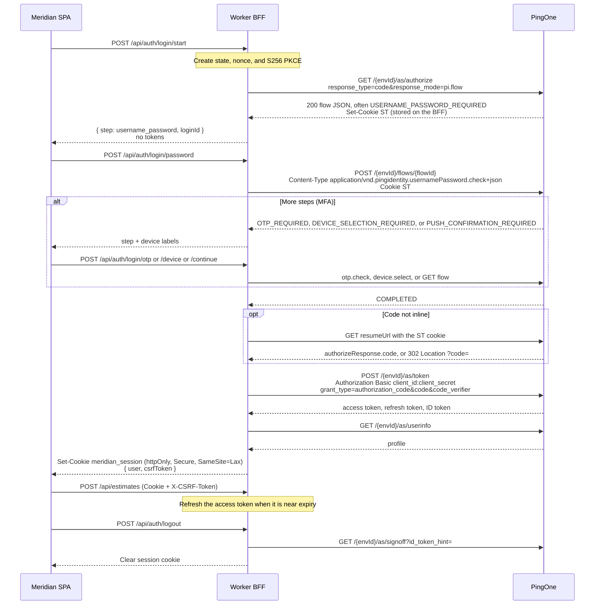

# Meridian

Meridian is a single-page estimating app for heavy civil bids, in the spirit of HCSS HeavyBid. A Cloudflare Worker is the backend-for-frontend: it owns PingOne login, keeps tokens and the client secret on the server, and stores estimate data in D1. The browser only receives an httpOnly session cookie.

Everything here runs on Cloudflare’s free plan, plus PingOne as the only external identity provider. A local mock mode runs the whole product with no tenant.

## Architecture

```text
Browser (React SPA)                Cloudflare Worker (BFF)                 PingOne
custom login UI          cookie     Hono API + static assets        pi.flow + Flows API
estimates workspace  <----------->  sessions in KV                  authorize / token / userinfo
                         JSON        estimates in D1
```

The SPA is built with Vite and served as Workers static assets. Requests under `/api/*` run the Worker first. TanStack Router and TanStack Query handle navigation and data loading. Zod schemas in `src/shared` validate writes on the Worker; the same cost functions price a bid in the browser (live preview) and again when a change is saved.

### pi.flow login

The browser never redirects to a PingOne-hosted page and never sees an access token, refresh token, ID token, or client secret.



Shapes follow PingOne’s current platform docs:

- `response_mode=pi.flow` returns the authorize response as JSON with status 200. `redirect_uri` is not required for that mode. When `PINGONE_REDIRECT_URI` is set, the BFF sends the same value on authorize and on the token request.
- Flow actions are `POST /{envId}/flows/{flowId}` with PingOne media types: `application/vnd.pingidentity.usernamePassword.check+json` (`{ username, password }`), `application/vnd.pingidentity.device.select+json` (`{ device: { id } }`), and `application/vnd.pingidentity.otp.check+json` (`{ otp }`).
- The BFF stores PingOne’s `ST` session cookie and sends it on later flow and resume calls.
- A completed authorization-code flow exposes `authorizeResponse.code`. If that field is absent, the BFF calls `resumeUrl` and accepts either a 200 JSON body or a 302 `Location` containing `code`.
- The token endpoint uses `CLIENT_SECRET_BASIC` (`Authorization: Basic`). PKCE `code_verifier` is sent because the authorize request included `code_challenge_method=S256`. The client secret is never placed in the URL or the form body.
- Logout calls `GET /{envId}/as/signoff?id_token_hint=` and always deletes the local session.

The app session lasts 12 hours. Access tokens are refreshed with `grant_type=refresh_token` when they are inside a minute of expiry. State-changing requests must send `X-CSRF-Token` matching the token issued with the session, and a browser `Origin` must match this app.

### Bid math

Hours = quantity ÷ production rate when a crew is assigned and the rate is above zero. Labor and equipment are that duration times the crew’s blended hourly rates (the whole spread, not one person). Material unit cost is multiplied by quantity and waste. Subcontract unit cost ignores waste. Lump sums are taken as entered.

Markups stack in this order: overhead on direct cost, profit on direct plus overhead, bond on that subtotal, contingency on direct cost. The bid is the sum. The browser recomputes this as you type; the Worker recomputes it when the change is saved.

## Local development

Requires Node.js 22 or newer.

```bash
npm install
cp .dev.vars.example .dev.vars
npm run dev
```

Open http://localhost:5173. `.dev.vars` turns mock mode on. Production config does not.

Mock account:

| | |
| --- | --- |
| Username | `robert@meridian.test` |
| Password | `stake-demo` |
| MFA password | `mfa-demo`, then code `482913` |

The first sign-in seeds **US 183 Frontage & Drainage — Segment 4**. Change a quantity and the bid total updates before you save. Save persists it in local D1.

Mock mode is active only when `PINGONE_MOCK` is the string `true`. `wrangler.jsonc` sets it to `false`. Do not deploy with mock mode on.

## PingOne setup

Create these in the PingOne admin console for the environment Robert will use. The BFF is a confidential OIDC client. It is not a single-page app and it is not a worker/service app.

1. **Application type:** OIDC **Web application**.
2. **Grant types:** Authorization Code and Refresh Token.
3. **Response type:** Code.
4. **Token endpoint authentication method:** Client Secret Basic.
5. **PKCE:** leave PKCE allowed. Meridian always sends `code_challenge_method=S256` together with the client secret. PingOne’s confidential-client token docs include `code_verifier` on that grant.
6. **Redirect URI:** register one HTTPS URL and set the same value as `PINGONE_REDIRECT_URI`. `pi.flow` does not send the browser there. The token endpoint still expects `redirect_uri` when the application has one, and it must match the authorize request. Example: `https://meridian.example.com/oauth/callback`.
7. **Sign-on policy:** a Login policy (username and password). Add an MFA policy if you want device selection, OTP, or push. Meridian renders those steps. Password reset, agreements, and FIDO assertion steps are reported and are not collected in this demo.
8. **Scopes:** request `openid profile email offline_access`. If the application has an OpenID resource grant, include `offline_access` on that grant so a refresh token is issued. If it has no resource grant, PingOne still issues a refresh token for the authorization-code grant when Refresh Token is enabled.
9. **CORS:** not required. The Worker calls PingOne, not the browser.
10. Copy the **Environment ID**, **Client ID**, and **Client Secret**.

Auth hosts, from PingOne’s regional API domains:

| Region | `PINGONE_AUTH_HOST` |
| --- | --- |
| North America | `https://auth.pingone.com` |
| Canada | `https://auth.pingone.ca` |
| Europe | `https://auth.pingone.eu` |
| Asia Pacific | `https://auth.pingone.asia` |
| Australia | `https://auth.pingone.com.au` |
| Singapore | `https://auth.pingone.sg` |

Confirm the host against [PingOne API domains](https://developer.pingidentity.com/pingone-api/auth/working-with-pingone-apis.html) if Ping changes a region.

## Deploy to Cloudflare (free)

```bash
npx wrangler login
npx wrangler d1 create meridian-estimator
npx wrangler kv namespace create SESSIONS
```

Put the real `database_id` and KV `id` into `wrangler.jsonc`. The committed ids are local placeholders. Change `name` if `meridian-estimator` is already taken on the account; `*.workers.dev` names are global.

Store the tenant settings as secrets so they are not committed:

```bash
npx wrangler secret put PINGONE_ENV_ID
npx wrangler secret put PINGONE_CLIENT_ID
npx wrangler secret put PINGONE_CLIENT_SECRET
npx wrangler secret put PINGONE_REDIRECT_URI
```

Leave `PINGONE_MOCK` as `false` in `wrangler.jsonc`. Set `PINGONE_AUTH_HOST` there if the tenant is not in North America.

```bash
npm run migrate:remote
npm run deploy
```

`npm run deploy` builds the SPA and Worker, then runs `wrangler deploy`. The site is served from the free `*.workers.dev` hostname. D1 holds estimates. KV holds sessions and in-progress logins. No paid Cloudflare products are required.

Sessions use `Secure` cookies on HTTPS, which is what Workers serve. Local `vite` is HTTP, so the cookie is not marked `Secure` there; otherwise the browser would drop it and the mock demo could not sign in.

## Scripts

| Script | Purpose |
| --- | --- |
| `npm run dev` | Vite and the Worker runtime, with local D1 and KV |
| `npm test` | Cost math and PingOne flow tests |
| `npm run typecheck` | Client and Worker TypeScript |
| `npm run lint` | ESLint |
| `npm run build` | Production bundle |
| `npm run deploy` | Build and `wrangler deploy` |
| `npm run migrate:local` / `migrate:remote` | Apply `migrations/` |

Schema SQL also runs on first API use (`CREATE TABLE IF NOT EXISTS`), so a missed migration does not block the first request.

## Project layout

```text
src/client     React SPA
src/worker     Hono BFF, PingOne client, D1 access
src/shared     Zod schemas, bid math, sample estimate
migrations     D1 schema
tests          Unit tests with PingOne fetch mocked
```

## Stack

TypeScript, React 19, Vite 8, TanStack Router, TanStack Query, Zod 4, Hono on Cloudflare Workers, D1, KV, Wrangler 4, Vitest. Versions are the current stable releases installed in this repo.
